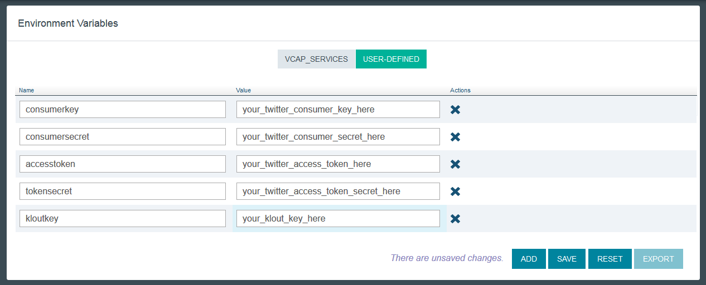
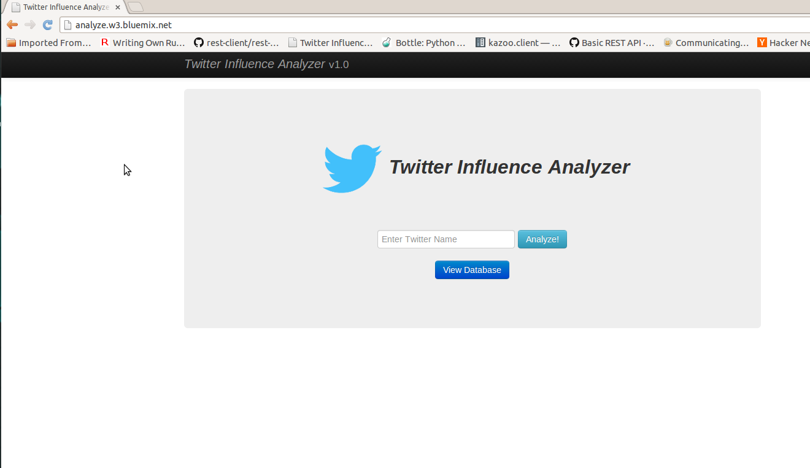
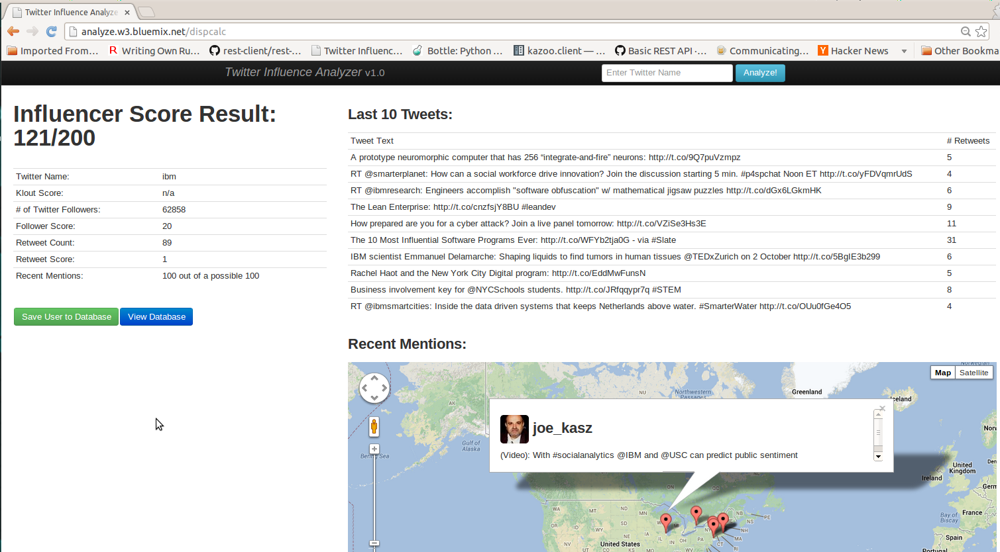
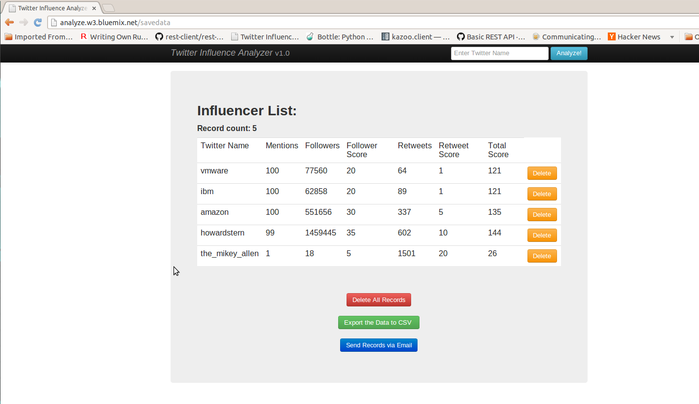

# How to Run and Deploy the Twitter Influence Analyzer #

## Overview of the app ##

This is a Python app that uses the [Bottle framework](http://bottlepy.org/docs/dev/) and the following services:

-   Cloudant (backend database)

Give it a try! Click the button below to fork into IBM DevOps Services and deploy your own copy of this application on Bluemix. Note the app will not yet work; you need to set the environment variables.

The environment variables are your Twitter and Klout API keys.

To set them, click on your app within Bluemix, click `Environment Variables` on the left pane, then select `USER_DEFINED` to add the five necessary environment variables. Put in your information using the EXACT strings in the "Name" column:

Hit save and you're done!

___

## External and Public APIs ##

This app uses some external APIs. You need to register the app with Twitter and Klout to get the keys and tokens for the environmental variables.

### Twitter v1.1 API ###

To access the Twitter API you need the consumer keys and access tokens, so you must register the app with Twitter. You can register your app [here](https://dev.twitter.com/).

[More information on how to register the app with Twitter](registerTwitter.md)

### Klout API ###

You can register the app with Klout [here](http://developer.klout.com/member/). When you register with Klout, you'll get a Klout Key, which you can use to create a Klout Object as shown in the code.

### Google Maps v3 API ###

This app uses the Google Maps v3 APIs. Google APIs are open for the developers and you do not need to register the app with Google. Here's the [link](https://developers.google.com/maps/documentation/javascript/tutorial) for the Google Maps APIs.

___

## [Alternatively] Deploying Via the Command-Line ##

#### Prerequisites ####

Before we begin, we first need to install the [**cf**](https://github.com/cloudfoundry/cli/releases) command line tool that will be used to upload and manage your application. If you've previously installed an older version of the cf tool, make sure you are now using v6 of cf by passing it the -v flag:

    cf -v

#### Steps ####
In the terminal, navigate to the root directory (where manifest.yml is located).

1. Login to Bluemix.

   | *usage:*   | `$ cf login [-a API_URL] [-o ORG] [-s SPACE]`|
   |------------|----------------------------------------------------|
   | *example:* | `$ cf login -a https://api.ng.bluemix.net`   |

2. Create an instance of the CloudantDB service, giving it a the name, cloudant_PTIA, in the last arguement.

   | *usage:*   | `$ cf create-service SERVICE PLAN SERVICE_INSTANCE`         |
   |------------|--------------------------------------------------------------------|
   | *example:* | `$ cf create-service cloudantNoSQLDB Shared cloudant_PTIA` |

3. From the root directory, push the app with the --no-start option so we can set our environment variables. Be sure to give your app a unique name to be used as its host. For example, the example below would result in https://ptia.mybluemix.net.

   | *usage:*   | `$ cf push APP [--no-start]`   |
   |------------|------------------------------------|
   | *example:* | `$ cf push ptia --no-start`    |

4. Create the environment variables that hold your twitter and klout keys

   | *usage:*   | `$ cf set-env APP_NAME ENV_NAME VALUE`                          |
   |------------|----------------------------------------------------------------------|
   | *example:* | `$ cf set-env ptia consumerkey <your_twitter_consumer_key>`  |
   
   There are five environment variables that you must set this way: your twitter consumer key, twitter consumer secret, twitter access token, twitter access token secret,     and your klout key. Each need to be given their respective names (EXACTLY as follows): consumerkey, consumersecret, accesstoken, tokensecret, and kloutkey.
   
5. Start the app

   | *usage:*   | `$ cf start APP_NAME`      |
   |------------|-------------------------------|
   | *example:* | `$ cf start ptia`           |

#### requirements.txt ####

If your Python app requires any external dependencies (i.e. any modules that you install using 'pip install'), you need to include them in the requirements.txt file. Each module must be downloaded and put in the directory of the app (e.g. app), and the relative path to that module must be included in the requirements.txt file.

You should not need to do this to deploy this app because the dependencies are already included in the requirements.txt file, and the external modules are also included in the root directory of the app. While deploying the app, the requirements.txt file should be detected and automatically install the dependencies.

## Screenshots ##

This is the home screen of the app. You can enter a twitter screen name in the text box and click the Analyze button to see their influence. You can also view any records saved in the database by clicking on the 'View Database' button.
    

After entering the twitter name and clicking the Analyze button, you'll be able to see the influence analysis of that person on the left side. You will also see their last 10 tweets and any recent mentions in the tweets plotted on Google Maps (if there is geolocation data for a tweet).
    

These are the records of the Influencers in the database. The user can export the records as csv file. There is also a feature to send the records in csv format to any person via email using the SMTP service, if the SMTP service is not bound to the application you can not do this and the features will be disabled. 
    

## License ##
Licensed under the Apache License, Version 2.0 (the "License"); you may not use this file except in compliance with the License. You may obtain a copy of the License at

     http://www.apache.org/licenses/LICENSE-2.0

Unless required by applicable law or agreed to in writing, software distributed under the License is distributed on an "AS IS" BASIS, WITHOUT WARRANTIES OR CONDITIONS OF ANY KIND, either express or implied. See the License for the specific language governing permissions and limitations under the License.
