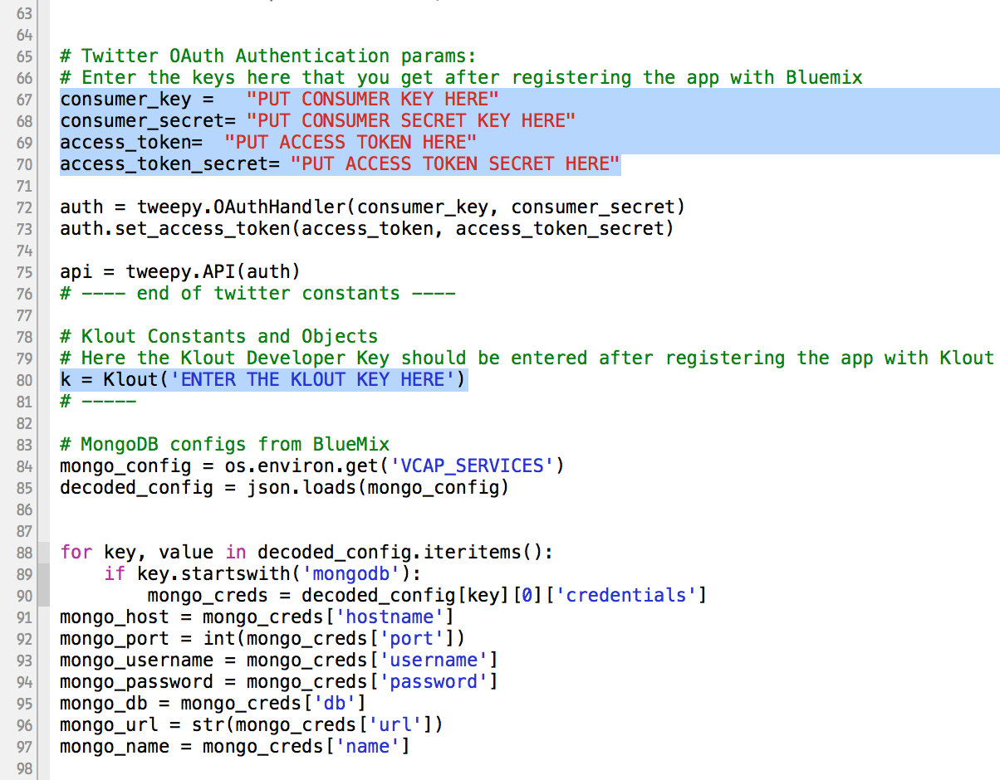

# How to Run and Deploy the Twitter Influence Analyzer #

## Overview of the app ##

This is a Python app that uses the [Bottle framework](http://bottlepy.org/docs/dev/) and the following services:

-   MongoDB (backend database)

## License ##
Licensed under the Apache License, Version 2.0 (the "License"); you may not use this file except in compliance with the License. You may obtain a copy of the License at

     http://www.apache.org/licenses/LICENSE-2.0

Unless required by applicable law or agreed to in writing, software distributed under the License is distributed on an "AS IS" BASIS, WITHOUT WARRANTIES OR CONDITIONS OF ANY KIND, either express or implied. See the License for the specific language governing permissions and limitations under the License.

## Prerequisites ##

Before we begin, we first need to install the [**cf**](https://github.com/cloudfoundry/cli/releases) command line tool that will be used to upload and manage your application. If you've previously installed an older version of the cf tool, make sure you are now using v6 of cf by passing it the -v flag:

    cf -v
		
## Download the App ##

The source for this app is at GitHub so, for example, if you are using the command line you can clone the repository like this:

	git clone https://github.com/ibmjstart/bluemix-python-sample-twitter-influence-app.git
		
## External and Public APIs ##

This app uses some external APIs. You need to register the app with Twitter and Klout to get the keys and tokens for the wsgi.py file.

### Twitter v1.1 API ###

To access the Twitter API you need the consumer keys and access tokens, so you must register the app with Twitter. You can register your app [here](https://dev.twitter.com/).

[More information on how to register the app with Twitter](registerTwitter.md)

### Klout API ###

You can register the app with Klout [here](http://developer.klout.com/member/). When you register with Klout, you'll get a Klout Key, which you can use to create a Klout Object as shown in the code.

### Google Maps v3 API ###

This app uses the Google Maps v3 APIs. Google APIs are open for the developers and you do not need to register the app with Google. Here's the [link](https://developers.google.com/maps/documentation/javascript/tutorial) for the Google Maps APIs.

Screen-shot of the wsgi.py file that shows where the Twitter keys and access tokens and Klout developer key is entered: 

## Deploying the App ##

After including the Twitter/Klout keys and tokens in the wsgi.py file (as shown above), you are ready to deploy the app. In the
terminal, go in the directory of the app (where wsgi.py is located). You can deploy/push the app using these commands:

### Method: Command-Line ###

In the terminal, go to the directory of the app, and follow these steps.

1. Login to Bluemix.

   | *usage:*   | `$ cf login [-a API_URL] [-o ORG] [-s SPACE]`|
   |------------|----------------------------------------------|
   | *example:* | `$ cf login -a https://api.ng.bluemix.net`   |

2. Create an instance of the postgreSQL service, giving it a unique name in the last arguement.

   | *usage:*   | `$ cf create-service SERVICE PLAN SERVICE_INSTANCE`|
   |------------|----------------------------------------------------|
   | *example:* | `$ cf create-service mongodb 100 mongodb_PTIA`          |

3. From the directory that houses the *wsgi.py* file, push the app with the --no-start option so we can bind our required service before starting.  Pass the -c flag to specify the start command that should be used by CloudFoundry to run your app.  Pass the -b flag to specify the Python build pack to be used, https://github.com/joshuamckenty/heroku-buildpack-python is recommended. Be sure to give your app a unique app name to be used as its host; for example, the example below would result in https://nmu.ng.bluemix.net.

   | *usage:*   | `$ cf push APP [--no-manifest] [--no-start] [-c COMMAND]`                |
   |------------|--------------------------------------------------------------------------|
   | *example:* | `$ cf push ptia --no-manfiest --no-start -b https://github.com/joshuamckenty/heroku-buildpack-python -c "python ./wsgi.py"`|

4. Bind the MongoDB service instance to the new app

   | *usage:*   | `$ cf bind-service APP SERVICE_INSTANCE`|
   |------------|-----------------------------------------|
   | *example:* | `$ cf bind-service ptia mongodb_PTIA`       |

5. Start the app

   | *usage:*   | `$ cf start APP`                 |
   |------------|----------------------------------|
   | *example:* | `$ cf start ptia`                 |

#### requirements.txt ####

If your Python app requires any external dependencies (i.e. any modules that you install using 'pip install'), you need to include them in the requirements.txt file. Each module must be downloaded and put in the directory of the app (e.g. app), and the relative path to that module must be included in the requirements.txt file.

You should not need to do this to deploy this app because the dependencies are already included in the requirements.txt file, and the external modules are also included in the root directory of the app. While deploying the app, the requirements.txt file should be detected and automatically install the dependencies.

## Screenshots ##

This is the home screen of the app. You can enter a twitter screen name in the text box and click the Analyze button to see their influence. You can also view any records saved in the database by clicking on the 'View Database' button.
    

After entering the twitter name and clicking the Analyze button, you'll be able to see the influence analysis of that person on the left side. You will also see their last 10 tweets and any recent mentions in the tweets plotted on Google Maps (if there is geolocation data for a tweet).
    

These are the records of the Influencers in the database. The user can export the records as csv file. There is also a feature to send the records in csv format to any person via email using the SMTP service, if the SMTP service is not bound to the application you can not do this and the features will be disabled. 
    

