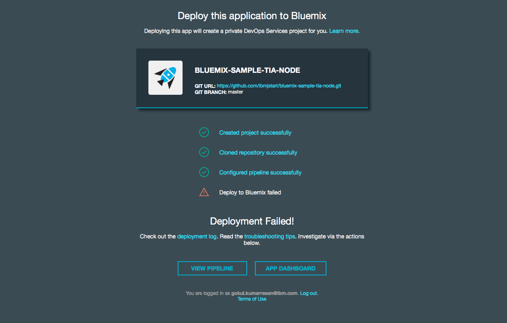
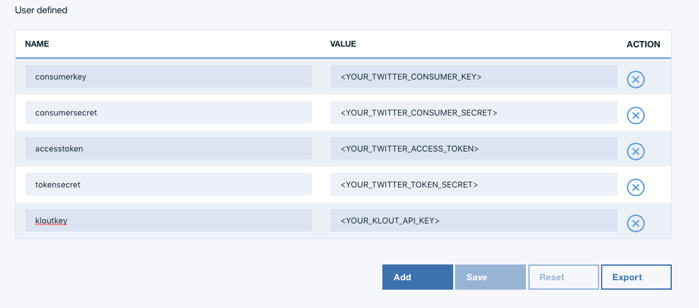

# How to Run and Deploy the Twitter Influence Analyzer #

## Overview of the app ##

This is a Python app that uses the [Bottle framework](http://bottlepy.org/docs/dev/) and the following services:

-   Cloudant (backend database)

Give it a try! Click the button below to fork into IBM DevOps Services and deploy your own copy of this application on Bluemix. Note the app will not yet work; you need to set the environment variables.

### Getting Your Environment Variables (Twitter and Klout API Keys) ###

Before you set up your environment variables, you will need to find your callback URL, which is just the URL the app will be running on:

1. Once you click on the "Deploy to Bluemix" button above, you will be taken to a page and will either need to log in or create a Bluemix account.

2. Once you have signed in, click on the blue "Deploy" button on the bottom right corner, and wait for it to finish creating and configuring your application. Again, your app will not yet be successfully deployed as your environment variables are not set up yet. Your screen should look like this:

 

3. Go to www.bluemix.net, and use the hamburger menu at the top right hand corner to to go to your Application Dashboard. Find our application (it should have the prefix "bluemix-sample-tia-node" followed by your username and a unique number sequence.

4. Copy the application's Route URL and save it to your clipboard. 

Before you can get your app running, you need to get Twitter and Klout API keys and set up your environment variables on B Bluemix. 

5. To get your Twitter API Keys, go here: 
<https://apps.twitter.com> 

6. Sign into your twitter account, click on "create new app", and fill out the form. For the callback URL, enter your Bluemix app's route URL you copied to your clipboard earlier. 

7. Once you have generated your Twitter app, navigate to Keys and Access Tokens, locate your Consumer Key and Consumer Secret. We will come back to this later.

8. Next, we will be generating our Klout API Keys. Go to <http://klout.com/s/developers/home>, and similar to what we did for the Twitter API, create a new app, fill out the form, and enter your Bluemix app's route URL for the callback URL section on the Klout API form. 

9. Once you have your Klout API keys generated, go back to www.bluemix.net, find your app on your Dashboard, click on it, and use the left panel to navigate to "Runtime". 

10. Once you're in the Runtime section, click on "Environment Variables", and add your Twitter and Klout API keys as shown below: (make sure the environemnt variable names match EXACTLY what is shown below, as in your Twitter Consumer key should be named "consumerkey", your Twitter Consumer Secret as "consumersecret", your Access Token as "accesstoken", your Token Secret as as "tokensecret", and your Klout Developer Key as "kloutkey")

Hit save and you're done! Your app is now live! In order to access it, go back to to the dashboard, and click on your app's Route URL.
___

### Google Maps v3 API ###

This app uses the Google Maps v3 APIs. Google APIs are open for the developers and you do not need to register the app with Google. Here's the [link](https://developers.google.com/maps/documentation/javascript/tutorial) for the Google Maps APIs.
___

## [Alternatively] Deploying Via the Command-Line ##

#### Steps ####
Before we begin, we first need to install the [**Bluemix Command Line Tool**] (http://clis.ng.bluemix.net/ui/home.html) as well as the [**CF Command Line Tool**](https://github.com/cloudfoundry/cli/releases) that will be used to upload and manage your application. If you've previously installed an older version of the cf tool, make sure you are now using cf v6 by passing it the -v flag:

    cf -v

In the terminal, go to the directory of your app and follow these steps:

1. Create a git clone of this repository.
    
    git clone https://github.com/ibmjstart/bluemix-python-sample-twitter-influence-app.git

2. Navigate to the project directory and login to Bluemix.

   | *usage:*   | `$ cf login [-a API_URL]`|
   |:-----------|:---------------------------------------------|
   | *example:* | `$ cf login -a https://api.ng.bluemix.net`   |

3. Create an instance of the CloudantDB service, giving it a the name, cloudant_PTIA, in the last arguement.

   | *usage:*   | `$ cf create-service SERVICE PLAN SERVICE_INSTANCE`         |
   |------------|--------------------------------------------------------------------|
   | *example:* | `$ cf create-service cloudantNoSQLDB Lite cloudant_PTIA` |

4. From the root directory, push the app with the --no-start option so we can set our environment variables. Be sure to give your app a unique name to be used as its host. For example, the example below would result in https://ptia.mybluemix.net.

   | *usage:*   | `$ cf push APP [--no-start]`   |
   |------------|------------------------------------|
   | *example:* | `$ cf push ptia --no-start`    |

4. Create the environment variables that hold your twitter and klout keys

   | *usage:*   | `$ cf set-env APP_NAME ENV_NAME VALUE`                          |
   |------------|----------------------------------------------------------------------|
   | *example:* | `$ cf set-env ptia consumerkey <your_twitter_consumer_key>`  |

   There are five environment variables that you must set this way: your twitter consumer key, twitter consumer secret, twitter access token, twitter access token secret, and your klout key. Each need to be given their respective names (EXACTLY as follows): consumerkey, consumersecret, accesstoken, tokensecret, and kloutkey.

5. Start the app

   | *usage:*   | `$ cf start APP_NAME`      |
   |------------|-------------------------------|
   | *example:* | `$ cf start ptia`           |
   
Congrats! Your app is now live on Bluemix. In your terminal, you should have recieved an output similar to the one below:

    requested state: started
    instances: 1/1
    usage: 256M x 1 instances
    urls: ptia.mybluemix.net
    last uploaded: Sun Jan 15 23:00:58 UTC 2017
    stack: cflinuxfs2
    buildpack: https://github.com/cloudfoundry/python-buildpack

         state     since                    cpu    memory         disk         details
    #0   running   2017-01-15 06:14:06 PM   0.0%   1.1M of 256M   1.3M of 1G
    gokuls-mbp:bluemix-python-sample-twitter-influence-app gokulkumarresen$ 

In order to view your app, copy and paste what follows the "urls: " tag in the output above into your browser. Enjoy!

#### requirements.txt ####

If your Python app requires any external dependencies (i.e. any modules that you install using 'pip install'), you need to include them in the requirements.txt file. Each module must be downloaded and put in the directory of the app (e.g. app), and the relative path to that module must be included in the requirements.txt file.

You should not need to do this to deploy this app because the dependencies are already included in the requirements.txt file, and the external modules are also included in the root directory of the app. While deploying the app, the requirements.txt file should be detected and automatically install the dependencies.

## Screenshots ##

This is the home screen of the app. You can enter a twitter screen name in the text box and click the Analyze button to see their influence. You can also view any records saved in the database by clicking on the 'View Database' button.

After entering the twitter name and clicking the Analyze button, you'll be able to see the influence analysis of that person on the left side. You will also see their last 10 tweets and any recent mentions in the tweets plotted on Google Maps (if there is geolocation data for a tweet).

These are the records of the Influencers in the database. The user can export the records as csv file. There is also a feature to send the records in csv format to any person via email using the SMTP service, if the SMTP service is not bound to the application you can not do this and the features will be disabled.

## License ##
Licensed under the Apache License, Version 2.0 (the "License"); you may not use this file except in compliance with the License. You may obtain a copy of the License at

     http://www.apache.org/licenses/LICENSE-2.0

Unless required by applicable law or agreed to in writing, software distributed under the License is distributed on an "AS IS" BASIS, WITHOUT WARRANTIES OR CONDITIONS OF ANY KIND, either express or implied. See the License for the specific language governing permissions and limitations under the License.
