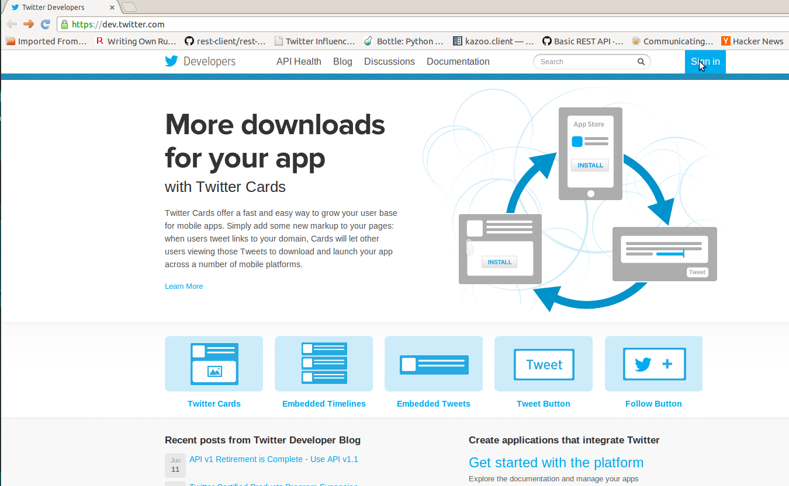
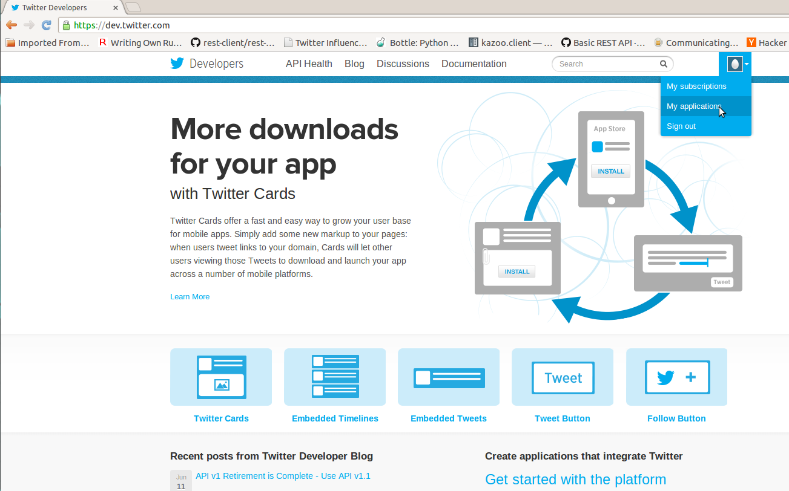
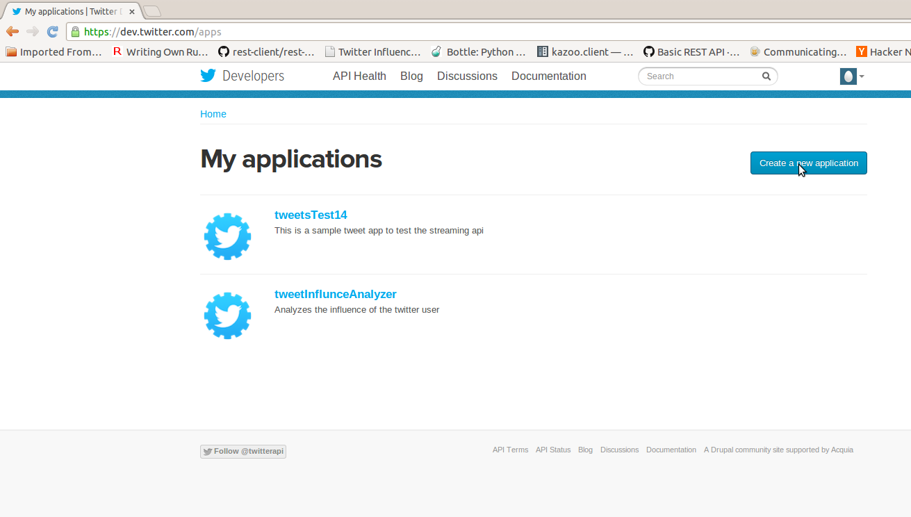
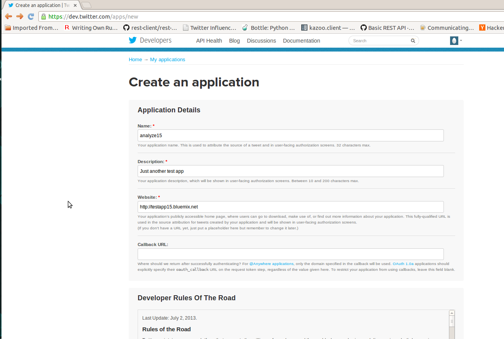
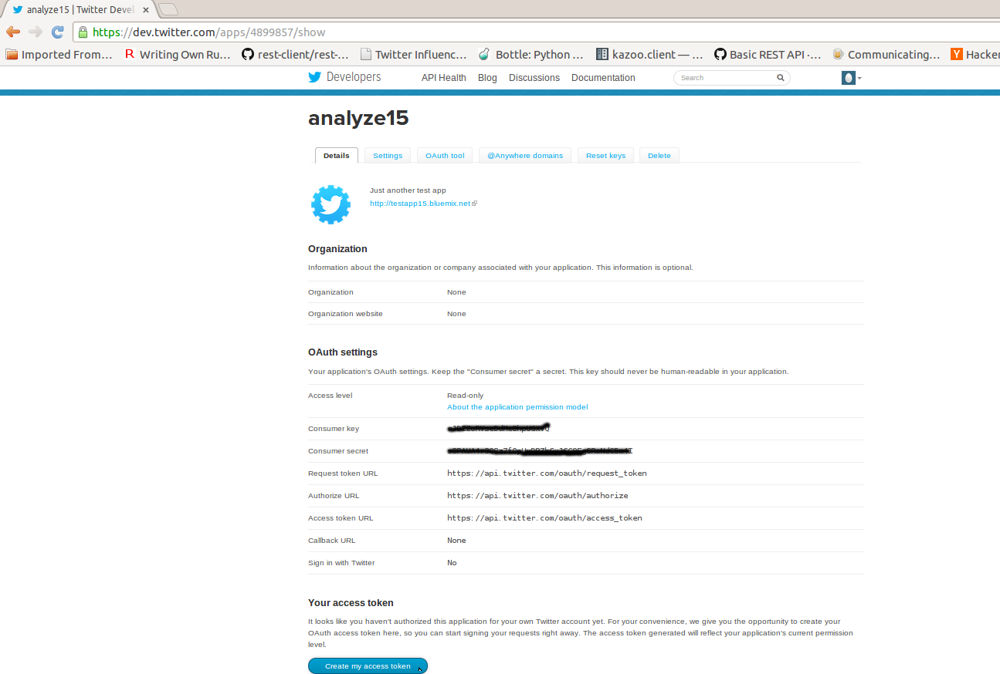
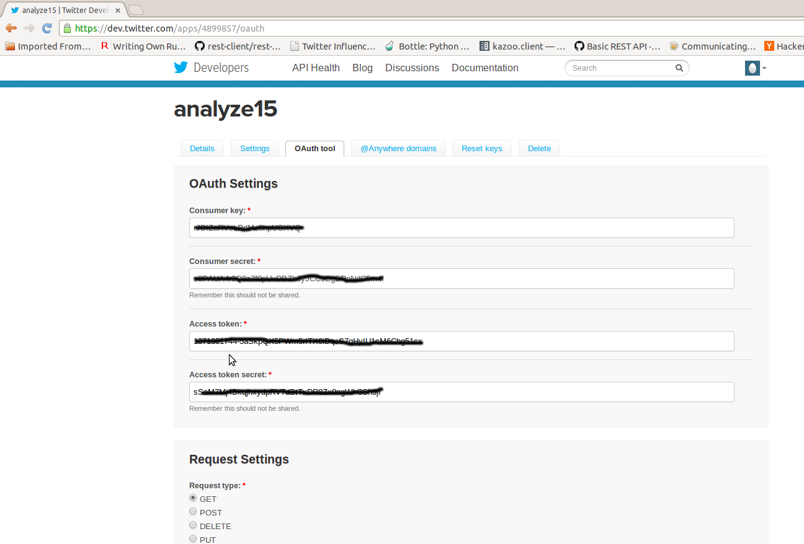

How to register the app with Twitter
====================================

-   You can register the app [here](https://dev.twitter.com/). When you
    click on the link you are forwarded to Twitter's developer site. You
    need to sign in with your Twitter account. If you don't have the
    twitter account, you must create one in order to get API access
    tokens. The sign in button is on the top right.
    
-   After logging in, you can manage your existing applications or
    create/register new applications with Twitter by clicking on 'My
    Applications' as shown below.
    
-   Register the app by clicking on 'Create a new application' button.
    
-   Fill in your app details. It doesn't really matter what you put for
    this, we're just interesting in getting API access.
    
-   After registering the app, you'll see the Consumer key and Consumer
    secret under OAuth settings. To get your API access token, click
    'Create my access token' at the bottom.
    
-   You can see the generated access token and access token secret by
    clicking on the OAuth tool tab.
    
-   Copy these tokens (consumer key, consumer secret, access token,
    access token secret) into the wsgi.py file and you will have access
    to the Twitter API. You will need to check the
    [documentation](https://dev.twitter.com/docs/api/1.1) to use the
    various REST APIs.

